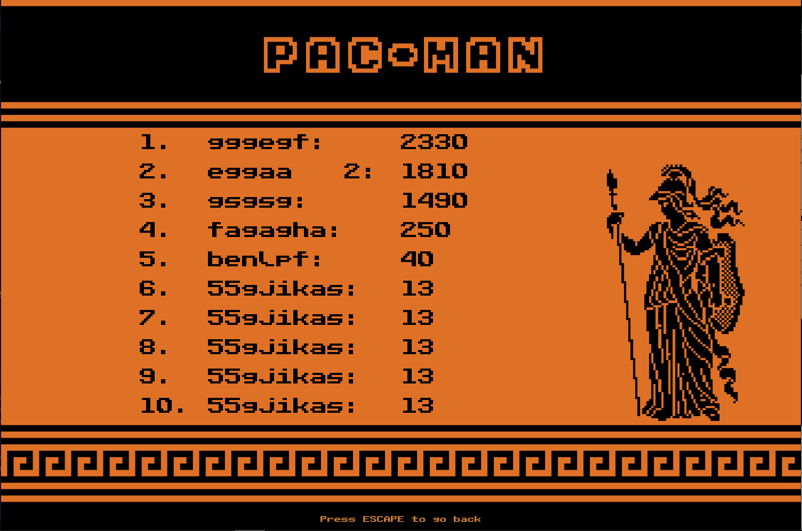

<div align="center">
    <i>This project has been created as part of the 42 curriculum by npillet and bbeaurai</i>
    <h1>Pac-Man</h1>
    <h3>Ghosts! More ghosts!</h3>
</div>

## Description
This project's goal is to recreate a complete and playable Pac-Man game in python.

## Instructions
With these commands, once entered inside the terminal, the program will be able to run.
``` bash
make # Runs the program after installing the necessary dependencies

python3 pac-man.py config.json # Runs the program
```

## Configuration
A few parameters need to be defined inside the configuration file, such as:
| Key | Value |
| --- | --- |
| highscore_filename | / |
| level | array with the width and height |
| lives | 3 |
| pacgum | 42 |
| points_per_pacgum | 10 |
| points_per_super_pacgum | 50 |
| points_per_ghost | 200 |
| seed | 42 |
| level_max_time | 90 |

Each of these parameters are used to define the aspects of the game.<br>
The `highscore_filename` is the file inside which the highest players score are kept. The `level` defines one or more levels dimensions (the width and the height). `lives` defines the players number of lives, the `pacgum` is (percentage or number of pacgum) available on the level.<br>
For `points_per_pacgum`, `points_per_super_pacgum` and `points_per_ghost` defines the points received for eating the pacgums, the super pacgums and the ghosts respectively. The `seed` defines a specific maze generation. Finally, the `level_max_time` defines the maximum time to complete the level.

## Highscore
The path to `leaderboard.json` has to be inside the root data folder.<br>
To display the highscores in the menu, the file is parsed. In this file, the differents names are ordered from highest to lowest score. To display them, the rank, the name and the score are alined from one line to another, like in the exemple below.


## Maze Generation
In the class `GameEngine`, the function `new_game()` creates the first game level that is then used inside the class `Maze` to draw the maze inside which the player will move.
As for the next levels, `...`

## Implementation
*technical summary of your implementation*

## General Software Architecture
*high-level overview of the software architecture (modules, classes and their relationships)*<br>
*(graph)*

## Project Management
The task realized during this project for each member are listed below:
- [bbeaurai | bebejamin1](https://github.com/bebejamin1)
  - Parsing
  - Leaderboard

- [npillet | noemiepi](https://github.com/noemiepi)
  - User interfaces (every views)
  - Assets' creation
  - README

A more detailed version of the management can be found `...`

## Resources
### Notions
#### Arcade library
- https://api.arcade.academy/en/development/index.html

### GitHub
- [noemiepi](https://github.com/noemiepi/A-Maze-ing)

- [Overtekk](https://github.com/Overtekk/PacMan)

- [sousampere](https://github.com/sousampere/42_pacman)

### AI Usage:
To find a few good classes and methods name, and make a few docstrings.
