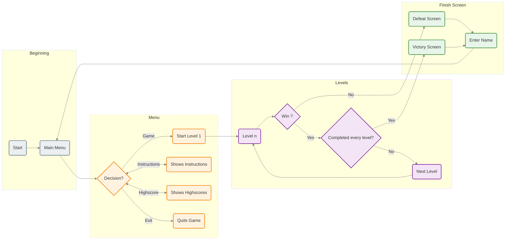

<div align="center">
    <i>This project has been created as part of the 42 curriculum by npillet and bbeaurai</i>
    <h1>Pac-Man</h1>
    <h3>Ghosts! More ghosts!</h3>
</div>

## Description
**Pac-Man** was first created in 1980 by Namco. It has four ghosts who each have their own algorithm.</br>
This project's goal is to recreate a complete and playable Pac-Man game in Python.
It has to be a deployment-ready package suitable for distribution on a public gaming platform.

## Instructions
With these commands, once entered inside the terminal, the program will be able to run.
``` bash
make # Run the program after installing the necessary dependencies

python3 pac-man.py config.json # Runs the program
```

And below, you will find other commands:
| Command | Description |
| :---: | --- |
| `make install` | Install the project's dependencies |
| `make run` | Execute the program (like the `make` command) |
| `make debug` | Run the script using the the Python built-in debugger |
| `make clean` | Remove temporary files and caches |
| `make lint` | Execute the `flake8` and `mypy` commands |
| `make lint-strict` | Execute the `flake8` and a stricter version of `mypy` commands |

## Configuration
A few parameters need to be defined inside the configuration file, such as:
| Key | Value |
| :---: | :---: |
| `highscore_filename` | / |
| `level` | Array with the width and height |
| `lives` | 3 |
| `pacgum` | 42 |
| `points_per_pacgum` | 10 |
| `points_per_super_pacgum` | 50 |
| `points_per_ghost` | 200 |
| `seed` | 42 |
| `level_max_time` | 90 |

Each of these parameters is used to define the aspects of the game.<br>
The `highscore_filename` is the file inside which the highest players' score are kept. The `level` defines one or more level dimensions (the width and the height). `lives` defines the players' number of lives, the `pacgum` is (percentage or number of pacgum) available on the level.<br>
For `points_per_pacgum`, `points_per_super_pacgum` and `points_per_ghost` define the points received for eating the pacgums, the super pacgums and the ghosts respectively. The `seed` defines a specific maze generation. Finally, the `level_max_time` defines the maximum time to complete the level.

The config file passed on the command line is always resolved under the `data/` folder (a bare filename is prefixed with `data/` automatically), which keeps every configuration and leaderboard file in one place. If the file does not exist yet, is not valid JSON, or is missing/invalid keys, it is regenerated with the default configuration below, a message is printed to explain what happened, and the game still starts — so the player is never blocked by a faulty config file.

The default configuration is given in the collapsible section below.
<details>
<summary>Default configuration</summary>

```json
{
  "highscore_filename": "data/leaderboard.json",
  "live": 3,
  "pacgum_points": 10,
  "super_pacgum_points": 50,
  "ghost_points": 200,
  "seed": 42,
  "level_max_time": 90,
  "level": [
    {
      "name": "Level 1",
      "width": 12,
      "height": 10
    },
    {
      "name": "Level 2",
      "width": 18,
      "height": 12
    },
    {
      "name": "Level 3",
      "width": 10,
      "height": 10
    },
    {
      "name": "Level 4",
      "width": 10,
      "height": 20
    },
    {
      "name": "Level 5",
      "width": 15,
      "height": 19
    },
    {
      "name": "Level 6",
      "width": 14,
      "height": 10
    },
    {
      "name": "Level 7",
      "width": 15,
      "height": 10
    },
    {
      "name": "Level 8",
      "width": 12,
      "height": 16
    },
    {
      "name": "Level 9",
      "width": 14,
      "height": 10
    },
    {
      "name": "Level 10",
      "width": 20,
      "height": 20
    }
  ]
}
```
</details>

## Highscore
The path to `leaderboard.json` has to be inside the root data folder.<br>
This file is presented like this:
```json
{
  "scores": [
    {
      "player_name": "erreip56",
      "player_score": 23280
    },
    {
      "player_name": "zorb",
      "player_score": 8400
    }
  ]
}
```
It contains the name of the person and their score and is ordered from highest to lowest score.
To display them in the menu, the file is parsed.</br>
To display them, the rank, the name and the score are aligned from one line to another, like in the example below.


## Maze Generation
In the class `GameEngine`, the function `new_maze()` creates the game's levels that are used inside the class `Maze` to draw them.<br>
The first level's maze is generated and stored by the function `generate_first_maze()`, which the game view then loads into its first `Maze`.

## General Software Architecture & Implementation
### General Software Architecture
#### Initialization

#### Algorithm
- Greddy
  - The Ghosts' algorithm
- Personality(Enum)
  - Different personalities of the ghost
- Mode(Enum)
  - Different states of the ghost

#### Game
- Cheats
  - States of a few implemented cheats, shared between the game view and the cheat menu

#### Maze
- Level
  - Stock level's information like the height and the width
- Maze
  - Generates the visual for the maze

#### Entities
- Player
- Enemies
- Object
  - Takes care of the pacgums and super-pacgums

#### Manager
- GameEngine
  - Handles every view of the game and the game window

#### Views
Different views rendering every state of the game:
- GameView
  - Handles the game progression
- MenuView
  - Shows the main game menu from which you can either: start the game, look at the instructions or the leaderboard or quit the game
- InstructionsView
  - Shows the game's instructions
- HighscoreView
  - Shows the name and scores registered inside `leaderboard.json`
- PauseView
  - Pause menu of the game
- CheatView
  - Activate or deactivate different cheats
- EndView
  - Register the name and score of the player in `leaderboard.json`


Here is a brief overview of how the game works.

```mermaid
graph LR
    classDef start fill:#eceff1,stroke:#607d8b,stroke-width:2px,color:#333;
    classDef start_sub stroke:#eceff1,stroke-width:2px;
    classDef menu fill:#fff3e0,stroke:#f57c00,stroke-width:2px,color:#333;
    classDef menu_sub stroke:#fff3e0,stroke-width:2px;
    classDef levels fill:#f3e5f5,stroke:#7b1fa2,stroke-width:2px,color:#333;
    classDef levels_sub stroke:#f3e5f5,stroke-width:2px;
    classDef finish fill:#e8f5e9,stroke:#388e3c,stroke-width:2px,color:#333;
    classDef finish_sub stroke:#e8f5e9,stroke-width:2px;

    subgraph Sub1["Beginning"]
      A(Start) --> B(Main Menu)
    end
    class Sub1 start_sub;
    class A,B start;

    subgraph Sub2["Menu"]
      B --> C{Decision?}
      C -->|Game| D(Start Level 1)
      C <-->|Instructions| E(Shows Instructions)
      C <-->|Highscore| F(Shows Highscores)
      C -->|Exit| G(Quits Game)
    end
    class Sub2 menu_sub;
    class C,D,E,F,G menu;

    subgraph Sub3["Levels"]
      D --> H(Level n)
      H --> I{Win ?}
      I -->|Yes| J{Completed every level?}
      J -->|No| M(Next Level)
      M --> H
    end
    class Sub3 levels_sub;
    class H,I,J,M levels;

    subgraph Sub4["Finish Screen"]
      direction RL
      I -->|No| K(Defeat Screen)
      J -->|Yes| L(Victory Screen)
      K --> N(Enter Name)
      L --> N
      N --> B
    end
    class Sub4 finish_sub;
    class K,L,N finish;

    linkStyle default stroke:gray;
```

### Implementation
We used the arcade library for the graphical rendering and a few game logic aspects like collisions.

For the ghosts, each has their own algorithm. One will chase the player, another will hide from them, a third will try to ambush and the last has a random way of moving.</br>

## Project Management
The task realized during this project for each member is listed below:
- [**bbeaurai | bebejamin1**](https://github.com/bebejamin1)
  - Parsing
  - Leaderboard
  - Ghosts algorithm and implementation

- [**npillet | noemiepi**](https://github.com/noemiepi)
  - User interfaces (every view)
  - Assets' creation
  - README

A more detailed version of the management can be found in the [**`project_management`**](project_management/) folder at the root of this repository.

## Itch.io Project Page
The game's page can be found [**here**]() (no link yet).

## Resources
### Notions
#### Arcade library
- https://api.arcade.academy/en/development/index.html

### GitHub
- [noemiepi](https://github.com/noemiepi/A-Maze-ing)

- [Overtekk](https://github.com/Overtekk/PacMan)

- [sousampere](https://github.com/sousampere/42_pacman)

### AI Usage:
AI (Claude Code) was used to find a few good classes and methods names and to help solve `make lint-strict` issues during development.<br>
It was also used, in a later pass, to write every missing docstring in `src/engine/` and `src/renderer/` (Google style, PEP 257: purpose, `Args`, `Returns`/`Raises`), to remove leftover inline development comments from those same modules, and to align the `flake8`/`mypy` lint scope with the subject (Makefile `lint`/`lint-strict` rules, `.flake8` and `pyproject.toml` excludes) so `flake8 .` and `mypy .` run cleanly from the project root. `src/parsing/` was intentionally left untouched in that pass, as it is still being iterated on manually. Every change was reviewed and re-checked with `make lint-strict` before being kept.
