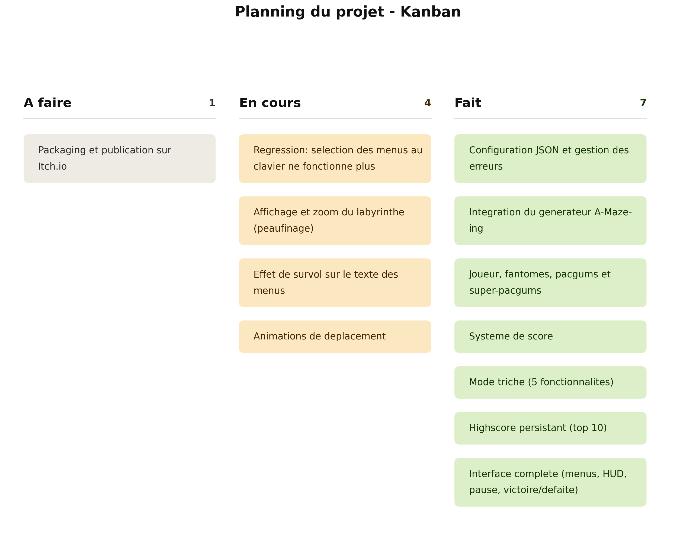
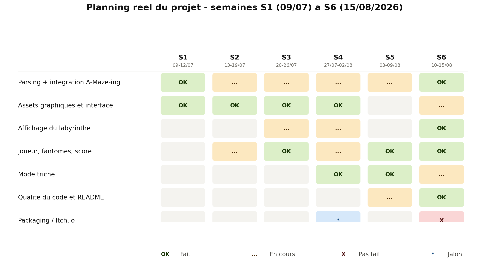
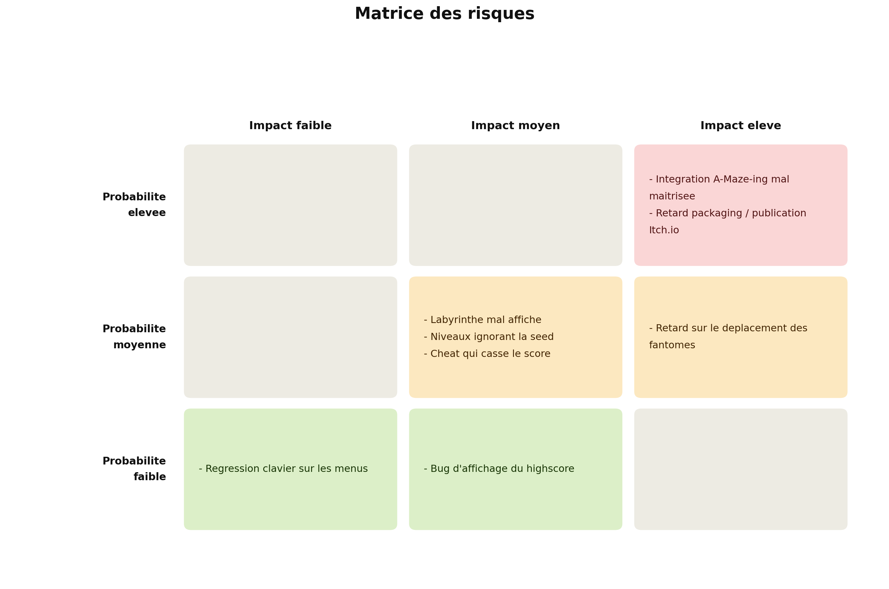
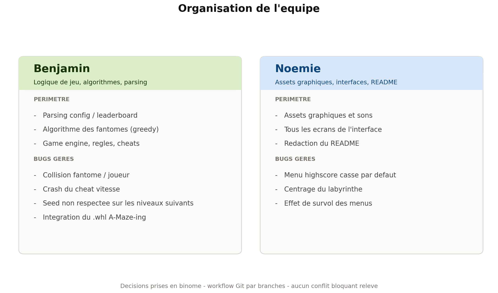
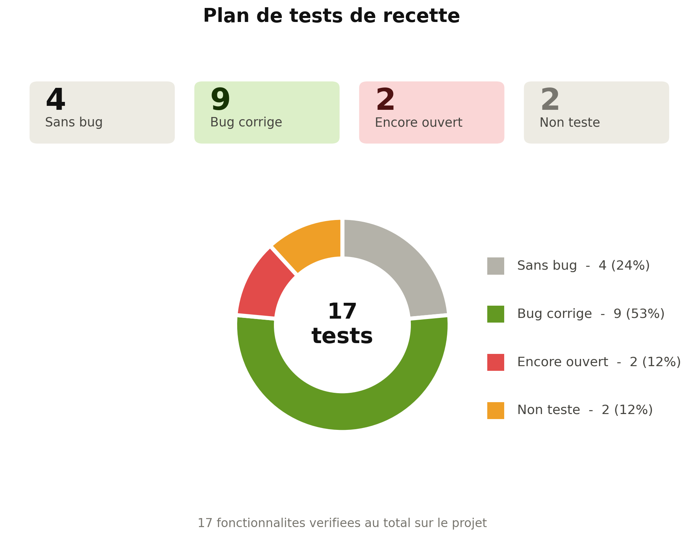

# Project management — Pac-Man

*Résumé du suivi de projet, reconstruit à partir du journal de bord daté (09/07/2026 → 15/08/2026) et du suivi de fonctionnalités de l'équipe.*

Équipe : **Benjamin** (bbeaurai / bebejamin1) — logique de jeu, algorithmes des fantômes, parsing, résolution de bugs
et **Noémie** (npillet / noemiepi) — assets graphiques, interfaces (UI), README, résolution de bugs.

Les captures du suivi (Kanban, Gantt, équipe, risques, tests) sont dans `project_management/Images/` et référencées au fil des sections ci-dessous.

---

## État d'avancement global (au 15/08/2026)

- ✅ **Fait** : configuration JSON + gestion des erreurs, intégration du générateur A-Maze-ing, structure des niveaux, joueur, fantômes (poursuite / fuite / respawn), pacgums & super-pacgums, système de score, progression du jeu (10 niveaux, timer, pause), mode triche (5 fonctionnalités), système de highscore persistant, ensemble des écrans UI (menu principal, HUD, pause, game over, victoire).
- ⏳ **Pas fait / en cours** : packaging et publication sur une plateforme publique (Steam/Itch.io) — compte Itch.io créé le 30/07/2026 mais le build n'est pas encore packagé ni publié. Quelques bugs mineurs résiduels sont encore ouverts (voir plus bas).

## A. Planning — Kanban

| A faire (1) | En cours (4) | Fait (10) |
| --- | --- | --- |
| Packaging & publication Itch.io | Régression : sélection des menus au clavier · Affichage/zoom du maze · Hover sur les menus · Animations | Config JSON, A-Maze-ing, joueur/fantômes, pacgums, score, mode triche, highscore, UI complète, lint-strict, README |

## Planning réel — par semaine (S1 → S6)

| Semaine | Période | Réalisations principales |
| --- | --- | --- |
| S1 | 09/07 – 12/07 | Parsing config + leaderboard, Makefile adapté ; assets quasi terminés |
| S2 | 13/07 – 19/07 | Placeholder algo fantômes ; boutons/collisions/sons ; main menu et HUD |
| S3 | 20/07 – 26/07 | Menu victoire/défaite/cheat ; correction highscore ; centrage 1er maze ; leaderboard live |
| S4 | 27/07 – 02/08 | Cheat mode quasi complet ; mise en place des fantômes ; compte Itch.io créé |
| S5 | 03/08 – 09/08 | `lint-strict` démarré ; déplacement des fantômes rendu fonctionnel |
| S6 (fin) | 10/08 – 15/08 | `lint-strict` terminé, README fini ; corrections diverses ; rédaction du project management |

## B. Suivi réel vs. prévisionnel — points clés

- **Conforme au prévu** : parsing/config, assets de base, menus, highscore, pacgums, `lint-strict`.
- **Retard absorbé** : menu pause (+quelques jours), assets graphiques (+2 jours).
- **Retard significatif mais résolu** : intégration A-Maze-ing (finalisée seulement le 14/08, alors qu'un placeholder existait depuis le 13/07) ; déplacement autonome des fantômes (+2 semaines, résolu le 09/08).
- **Non finalisé à ce jour** : packaging et publication (seul point obligatoire du sujet encore ouvert).

## C. Analyse du projet — choix clés

- **A-Maze-ing imposé** : intégré en `.whl` via `uv`, `PERFECT=False`. L'intégration réelle n'a été finalisée que le 14/08.
- **JSON pour config + highscore** : imposé pour la config, gardé par cohérence pour le highscore (liste triée, top 10, pas besoin d'une base de données).
- **Mode triche propre** : classe `Cheats` dédiée dans le moteur de jeu, consultée par la logique normale (pas de duplication des règles).
- **Compromis** : priorité donnée au parsing/config, au labyrinthe, aux entités et au score ; le packaging a été repoussé en fin de projet.
- **Outils** : `arcade` (rendu), `uv` (dépendances), `flake8` + `mypy --strict` (qualité), Git en branches fusionnées progressivement.
- **À refaire différemment** : valider l'intégration d'A-Maze-ing plus tôt ; prévoir une marge dédiée au packaging.

## D. Matrice des risques

| | Impact faible | Impact moyen | Impact élevé |
| --- | --- | --- | --- |
| **Probabilité élevée** | — | — | Intégration A-Maze-ing mal maîtrisée · Retard packaging/publication |
| **Probabilité moyenne** | — | Labyrinthe mal affiché · Niveaux ignorant la seed · Cheat cassant le score | Retard sur le déplacement des fantômes |
| **Probabilité faible** | Régression clavier sur les menus | Bug d'affichage du highscore | — |

Tous les risques marqués comme matérialisés dans le journal de bord ont été résolus, à l'exception de la **régression clavier** et du **retard de packaging**, encore ouverts au 15/08.

## E. Organisation de l'équipe

| Membre | Périmètre | Bugs gérés |
| --- | --- | --- |
| **Benjamin** | Parsing config/leaderboard, algorithme des fantômes (greedy), game engine, règles, cheats | Collision fantôme/joueur, crash cheat vitesse, seed non respectée, intégration du `.whl` A-Maze-ing |
| **Noémie** | Assets graphiques et sons, tous les écrans UI, rédaction du README | Menu highscore cassé par défaut, centrage du labyrinthe, hover des menus |

Décisions prises en binôme, workflow Git par branches fusionnées progressivement. **Aucun conflit bloquant** relevé ; seul point de vigilance : retard de +2 jours sur les assets graphiques, communiqué tôt et absorbé.

## F. Plan de tests de recette — résultat

**17 fonctionnalités vérifiées** : 4 sans bug, 9 avec bug trouvé et corrigé, 2 encore ouvertes (collision joueur/mur, sélection clavier des menus), 2 non testées (spawn pacgum à confirmer, packaging final).

## G. Blocages et conflits — résumé

**Résolus :**
- Intégration du générateur A-Maze-ing (le plus long blocage, résolu le 14/08)
- Affichage / centrage du labyrinthe
- Affichage du highscore + niveaux ignorant la seed

**Encore ouverts au 15/08 :**
- Packaging et publication Itch.io
- Régression clavier sur les menus

**Conflits :** aucun conflit bloquant entre les deux membres de l'équipe.

---

*Document généré à partir du journal de bord du projet (frame "UPDATE" de l'excalidraw) et du suivi de fonctionnalités coché par l'équipe. Le détail visuel de chaque section (Kanban, Gantt, équipe, risques, tests) est disponible dans le dossier `project_management/Images/`.*
